# 🚀 Freelancer Marketplace

🔗 **Live Demo:**  
👉 https://freelancer-marketplace-sandy.vercel.app/

---

## 📌 Overview

Freelancer Marketplace is a full-stack web application where clients can hire freelancers and freelancers can showcase their services (gigs), manage orders, and receive ratings.

This project demonstrates real-world features like authentication, role-based access, order management, and messaging.

---

## ✨ Features

### 👤 Authentication
- Secure user registration & login
- JWT-based authentication
- Role-based access (Client / Freelancer)

---

### 💼 Freelancer Features
- Create, edit, and delete gigs
- Manage personal dashboard
- Track orders
- View ratings & reviews

---

### 🧑‍💻 Client Features
- Browse freelancers and gigs
- Hire freelancers
- Manage orders
- Cancel orders

---

### ⭐ Rating System
- Clients can rate freelancers
- Average rating calculation
- Ratings visible on gigs and profiles

---

### 💬 Chat System
- Messaging between client and freelancer
- Unread message indicator

---

### 📦 Order System
- Create orders
- Accept / Complete / Cancel orders
- Order status tracking

---

## 🛠️ Tech Stack

### Frontend
- React.js
- Vite
- CSS

### Backend
- Node.js
- Express.js

### Database
- MongoDB Atlas

### Authentication
- JWT (JSON Web Token)

### Deployment
- Frontend: Vercel
- Backend: Render

---

## 🌐 API Base URL
https://freelancer-marketplace-1.onrender.com

---

## ⚙️ Environment Variables

### Backend (.env)
PORT=5000
MONGODB_URI=your_mongodb_atlas_url
JWT_SECRET=your_secret_key
NODE_ENV=production

---

### Frontend (.env)
git clone https://github.com/Nitesh-Pandit/Freelancer-Marketplace/tree/main/client

---

### 2️⃣ Backend Setup
cd server
npm install
npm start

---

### 3️⃣ Frontend Setup
cd client
npm install
npm run dev

---

## 📸 Screenshots

> (Add screenshots here for better presentation)
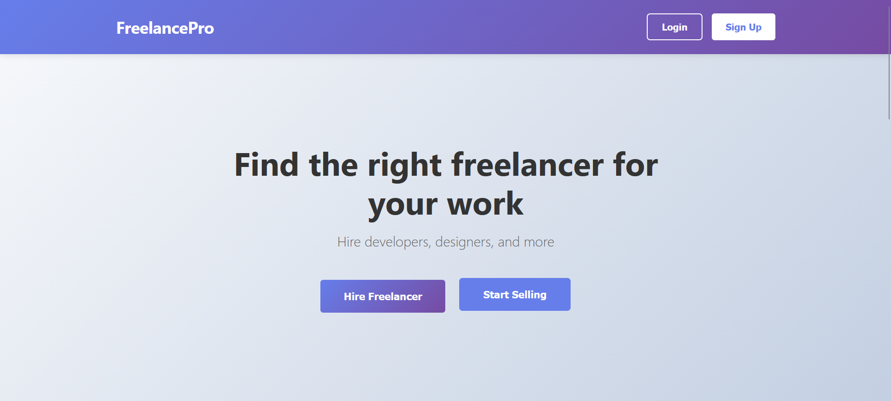
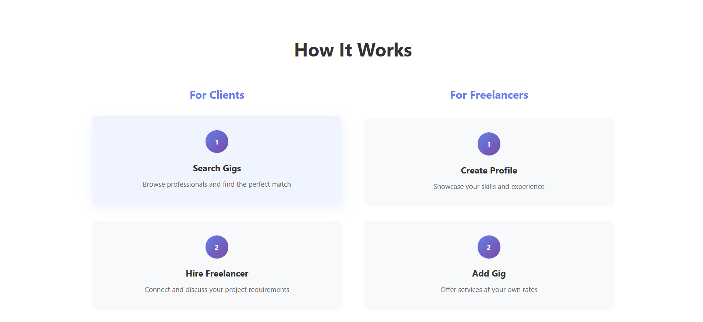
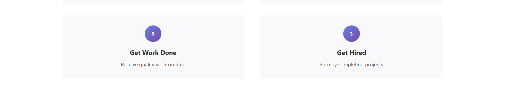
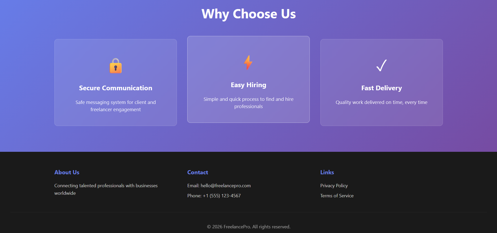
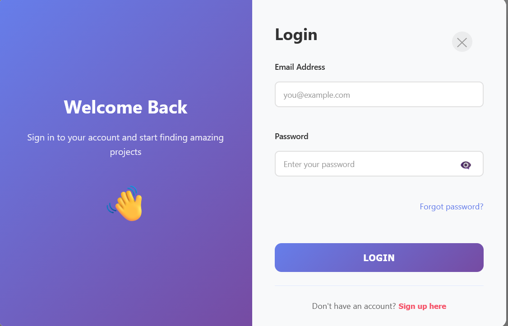
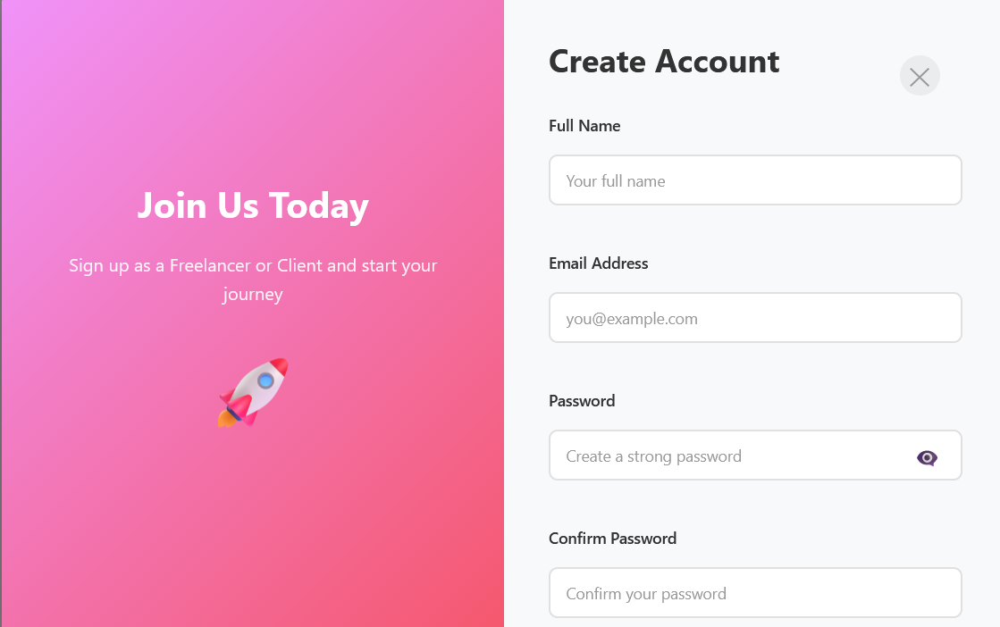
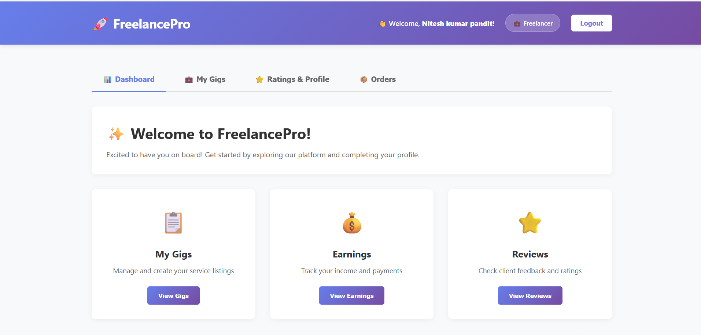
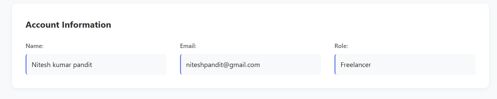
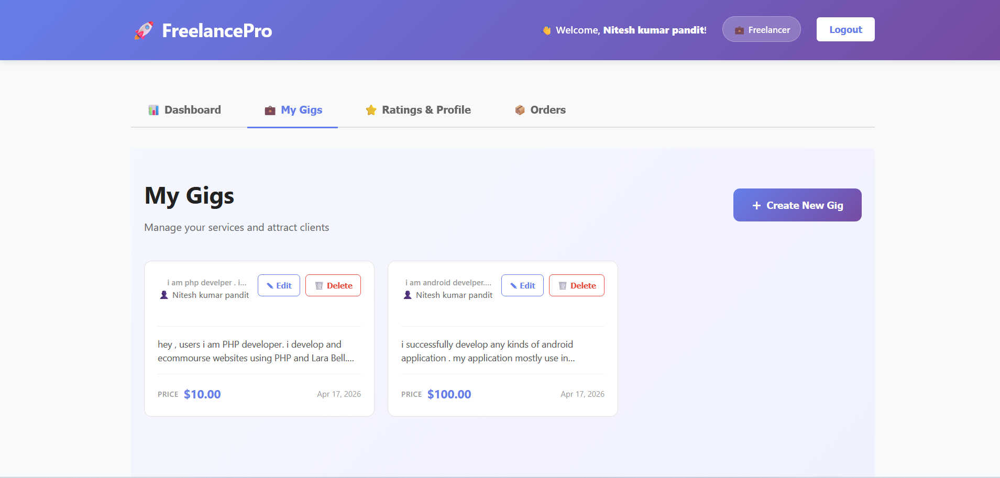
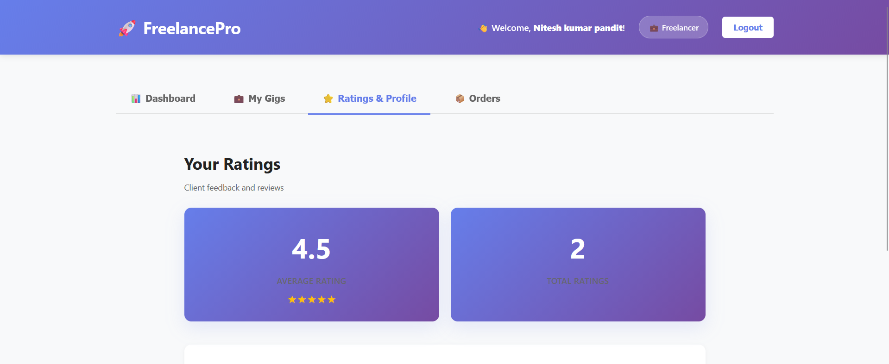
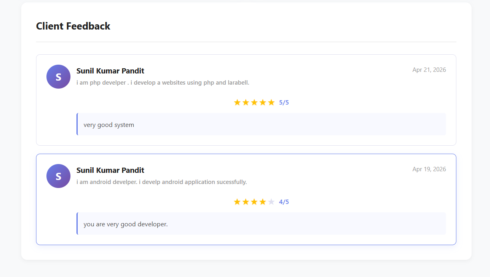
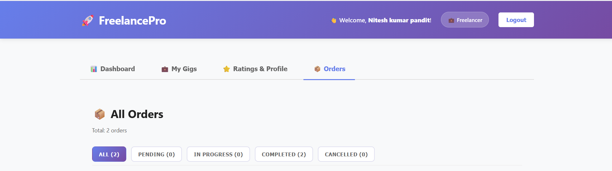
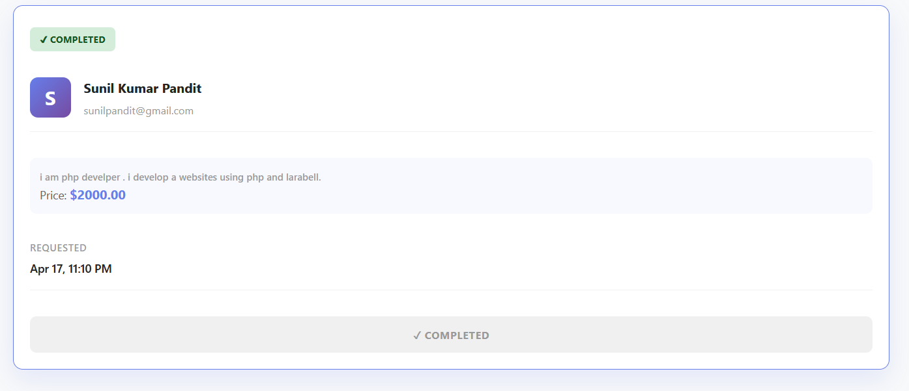
---

## ⚠️ Known Limitations

- Slow initial load (Render free tier)
- No payment gateway yet
- Basic UI design

---

## 🔮 Future Improvements

- Payment integration (Stripe)
- Notifications system
- Improved UI/UX
- Advanced search & filters

---

## 👨‍💻 Author

**Nitesh kumar pandit**

---

## 📢 Project Highlights

- Full-stack MERN application  
- REST API development  
- JWT authentication system  
- Role-based access control  
- Real-world project structure  
- Deployment on cloud platforms  

---

⭐ If you like this project, give it a star!